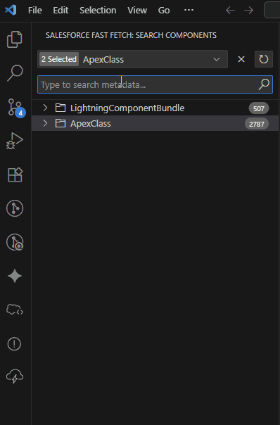

# Salesforce Fast Fetch for Visual Studio Code

Salesforce Fast Fetch is a VSCode extension to search, download or delete salesforce/omnistudio components with ease.

### Features

* Search Salesforce/Omnistudio Metadata with ease(Better UX than SF Org Browser).
* Download Metadata to Local workspace.
* Check who has modified/created the Metadata.
* Delete Meatadata with ease.

## Prerequisites

* [Install Salesfore CLI](https://developer.salesforce.com/docs/atlas.en-us.sfdx_setup.meta/sfdx_setup/sfdx_setup_install_cli.htm#sfdx_setup_install_cli)
* [Install  Salesforce CLI Integration Extension](https://marketplace.visualstudio.com/items?itemName=salesforce.salesforcedx-vscode-core)

### Known Issues

* Metadata selection combo box always displays a random selected metadata type.

